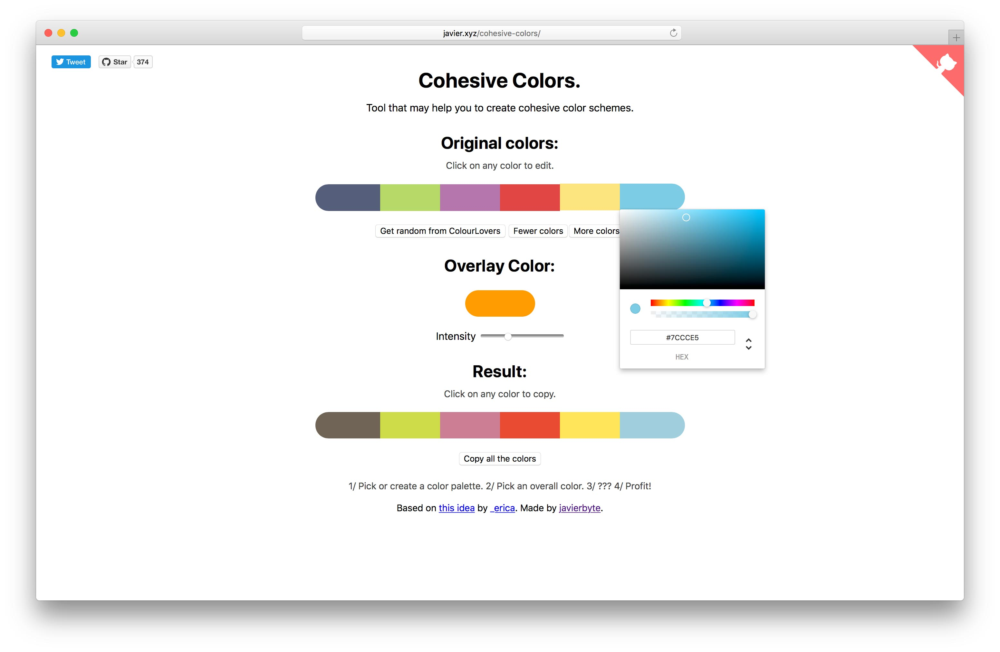

# [cohesive-colors](http://javier.xyz/cohesive-colors)

A tool for creating more cohesive color schemes.
Pick a bunch of random colors that you like and add a touch of magic.

For programatic use see [colorblendjs](https://github.com/javierbyte/colorblendjs).

Thanks [_erica](https://twitter.com/_erica) for the idea.
